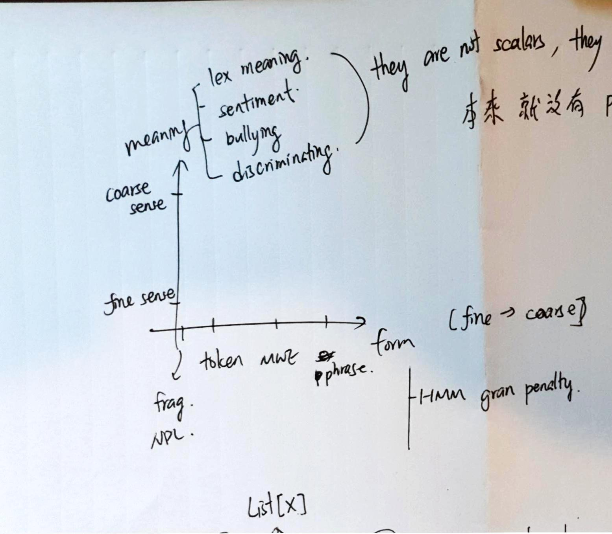
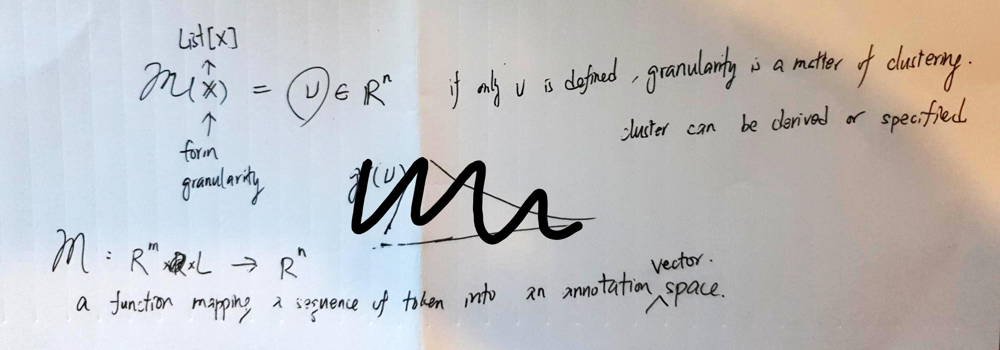

# Granularity System

## Naive form/meaning axis

* Granularity on forms
  * Maximal matching with DeepLex
  * Granularity penalized HMM
* Granularity on meaning
  * Sense vectors
  * BUT, what are granularized meanings on coarse-grained form/token?
  * What are granularized meanings/annotations?

## A function approach

Granularized annotations are a function from sequence of characters to an annotation vectors. This function can be tabularized as human inputs, or learned through supervised learning or reinforced learning (or, a simpler form, contextual bandit).

$$
\begin{gathered}

\mathcal{M}(\mathbf{x}) = \nu \in \R^n \\
\mathcal{M}: \R^m \times L \rightarrow \R^n

\end{gathered}
$$

where $\mathcal{M}$ is a mapping function, $\nu$ is an annotation represented as a vector in vector space $\R^n$. Each character in the text is represented as embeddings in $\R^m$ space, each is of length $L$. 